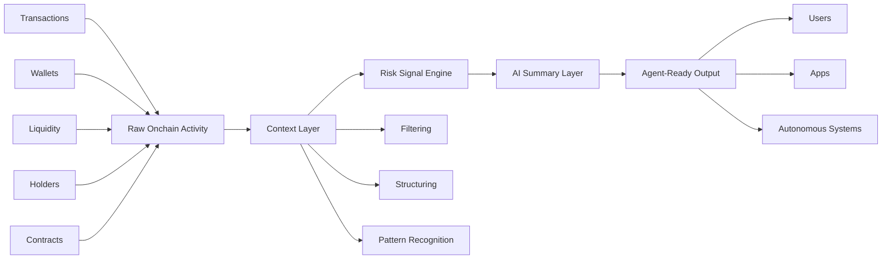
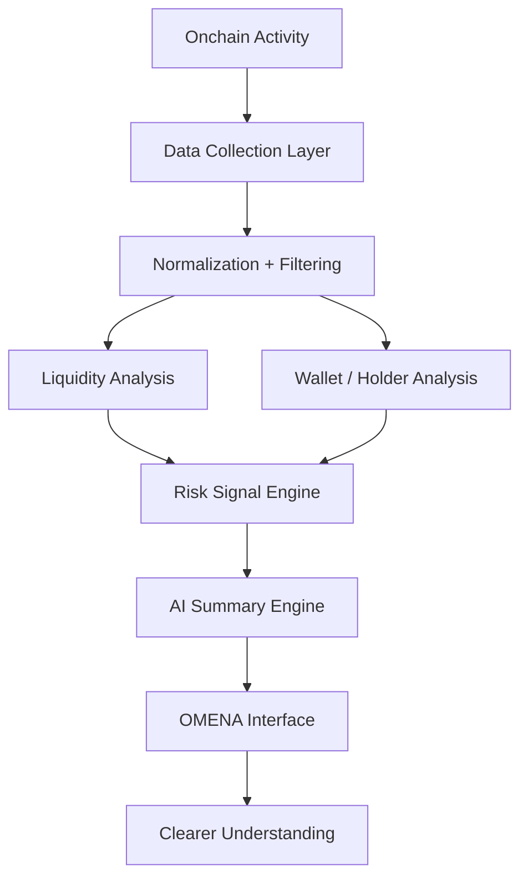

# OMENA

> **The Agent Intelligence Layer for Autonomous Onchain Systems**
>
> Transforming raw onchain activity into structured intelligence for AI agents.

[](#current-status)
[](#license)
[](#contributing)

---

## Overview

**OMENA** is an open-source intelligence layer designed to help autonomous systems understand onchain environments before they act.

Instead of exposing AI agents to raw blockchain activity, OMENA processes token activity, wallet behavior, liquidity movement, holder distribution, and risk signals into clearer context.

The goal is simple:

> **Less noise. More understanding.**

---

## Why OMENA?

The onchain world is getting faster.

New agents, protocols, execution layers, and flows of capital are emerging every day. But speed alone does not create better systems.

Autonomous systems need context before execution.

OMENA is being built to help answer questions like:

- What is happening behind a token?
- How is liquidity behaving?
- Are holders concentrated or distributed?
- What wallets are interacting with the asset?
- Are there risk signals worth paying attention to?
- Can this activity be summarized into something easier to understand?

Price shows movement.

**OMENA is focused on context.**

---

## The Intelligence Loop



OMENA turns activity into context, and context into understanding.

---

## What OMENA Analyzes

The first OMENA experience focuses on **token intelligence**.

Core analysis areas include:

- Liquidity behavior
- Holder distribution
- Wallet activity
- Risk signals
- AI-generated summaries

This first version is designed to make token activity easier to understand, especially for users and systems that need faster context before taking action.

---

## Core Components

| Component | Description |
|---|---|
| `indexer` | Collects onchain activity and token data. |
| `liquidity_analyzer` | Reads liquidity movement, changes, and concentration. |
| `holder_analyzer` | Tracks distribution and concentration across holders. |
| `wallet_activity_engine` | Observes wallet behavior and interaction patterns. |
| `risk_signal_engine` | Detects suspicious or abnormal activity. |
| `ai_summary_engine` | Converts structured signals into readable summaries. |
| `interface` | Presents insights in a clean product experience. |

---

## System Architecture



---

## Current Status

OMENA is in **active development**.

The first working version is being refined for public beta testing.

The public beta will focus on the first product experience: analyzing token activity and presenting clearer context through structured intelligence.

Development is ongoing and the system will continue to improve through iteration, feedback, and testing.

---

## Roadmap

### Phase 1 — Foundation

- [ ] Repository cleanup
- [ ] Open-source preparation
- [ ] First product feature
- [ ] Public beta testing
- [ ] Basic token analysis flow

### Phase 2 — Intelligence Layer

- [ ] Improved data processing
- [ ] Liquidity behavior analysis
- [ ] Holder distribution analysis
- [ ] Wallet activity analysis
- [ ] Risk signal detection
- [ ] AI-generated summaries

### Phase 3 — Expansion

- [ ] More refined intelligence outputs
- [ ] Better risk interpretation
- [ ] More token-level context
- [ ] Expanded agent-ready data structures
- [ ] Developer documentation

### Phase 4 — Agent Integration

- [ ] API access
- [ ] SDK experiments
- [ ] Agent-readable intelligence outputs
- [ ] Broader autonomous system integrations

---

## Repository Structure

```txt
omena/
├── apps/
│   └── web/                    # OMENA web interface
│
├── packages/
│   ├── core/                   # Core intelligence logic
│   ├── analyzer/               # Token analysis modules
│   ├── risk/                   # Risk signal logic
│   ├── ai/                     # AI summary layer
│   └── ui/                     # Shared UI components
│
├── public/
│   └── assets/                 # Static assets
│
├── docs/
│   ├── architecture.md         # System architecture notes
│   ├── roadmap.md              # Development roadmap
│   └── beta.md                 # Public beta notes
│
└── README.md
```

---

## Quick Start

Clone the repository:

```bash
git clone https://github.com/omenaai/omena.git
cd omena
```

Install dependencies:

```bash
npm install
```

Run the development server:

```bash
npm run dev
```

Build for production:

```bash
npm run build
```

---

## Environment Variables

Create a `.env.local` file:

```env
NEXT_PUBLIC_APP_URL=http://localhost:3000
```

Additional variables will be documented as the product evolves.

---

## Beta Testing

The first public beta will allow users to experience the early OMENA product flow.

The beta is intended to:

- Test the first product experience
- Collect feedback from early users
- Improve analysis quality
- Refine the interface
- Validate the direction of OMENA

The beta is not the final version.

OMENA will continue to evolve through continuous iteration.

---

## Development Philosophy

Good infrastructure is not built in one push.

It is shaped through iteration, feedback, and patience.

OMENA is being built with a simple principle:

> **Ship meaningful progress, not empty noise.**

---

## Contributing

OMENA welcomes builders, researchers, designers, and developers interested in AI infrastructure and onchain intelligence.

You can contribute by:

- Opening issues
- Suggesting improvements
- Reviewing documentation
- Testing beta features
- Submitting pull requests

More contribution guidelines will be added as the repository becomes more mature.

---

## Disclaimer

OMENA is an experimental technology project in active development.

Information generated by OMENA should not be treated as financial advice.

Users should always do their own research before making decisions involving digital assets.

---

## License

MIT License.

---

<p align="center">
  <strong>OMENA</strong><br />
  Agent Intelligence Layer for autonomous onchain systems.<br />
  <em>Less noise. More understanding.</em>
</p>
